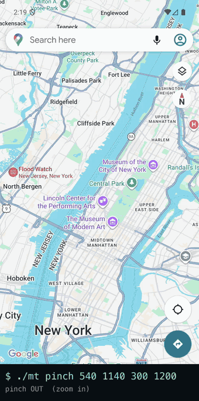
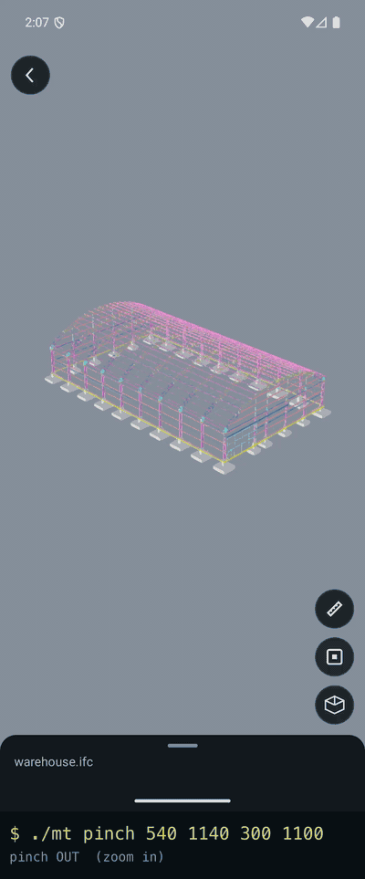

# adb-multitouch

Two-finger **pinch**, **pan** and tap over `adb` — **no root, no instrumented test.**

`adb shell input` only does single-touch. This is a tiny `app_process` tool that injects real
multi-pointer `MotionEvent`s through the framework (`InputManager.injectInputEvent`) — the same
privileged path `input` itself uses — so it works as the **shell** user with **SELinux enforcing**:
non-rootable emulators and physical devices alike.

## Getting started

You need `adb` on your `PATH` and a device with USB debugging on. **No build step** — the `mt.jar`
in this repo is prebuilt, and there's nothing to install on your machine beyond the repo itself.

```bash
git clone https://github.com/nowjordanhappy/adb-multitouch.git
cd adb-multitouch

adb devices                    # your device should be listed as "device", not "unauthorized"
./mt install                   # pushes mt.jar to /data/local/tmp (once per device)

./mt pinch 540 1170 300 1300   # pinch out on whatever is on screen right now
```

If the last line zooms something, you're done. Nothing is installed as an app, nothing persists
beyond a 3KB jar in `/data/local/tmp` — delete it with
`adb shell rm /data/local/tmp/mt.jar` when you're finished.

`./mt install` is optional: any command auto-pushes the jar if it's missing.

## Usage

```bash
./mt install                          # push mt.jar to the device (once)
./mt pinch 540 1170 300 1300          # pinch OUT (zoom in): finger gap 300px -> 1300px around (540,1170)
./mt pinch 540 1170 1300 300          # pinch IN  (zoom out)
./mt pan   540 1170 0 -600            # two-finger drag up by 600px
./mt tap   540 1170
./mt pinch 540 1170 300 1300 30 800   # slower, smoother: 30 steps over 800ms
./mt -s emulator-5556 pinch 540 1170 300 1300   # target a specific device
./mt                                  # no args: print this usage
```

### What the numbers mean

```
pinch <cx> <cy> <startGap> <endGap> [steps] [ms]
pan   <cx> <cy> <dx> <dy>           [steps] [ms]
tap   <x> <y>
```

| | |
|---|---|
| `cx` `cy` | Where the gesture is centred, in **screen pixels** — same coordinate space as `input tap`. `adb shell wm size` prints the screen; the middle of a 1080×2400 phone is `540 1200`. |
| `startGap` `endGap` | How far apart the two fingers are, in pixels, at the start and at the end. **End bigger than start = pinch out = zoom in**; the other way round zooms out. |
| `dx` `dy` | How far both fingers travel, in pixels. `y` grows **downward**, so a negative `dy` drags up — `0 -600` is a 600px upward drag. |
| `steps` | How many MOVE events the gesture is split into (default `12`). More steps = smoother, which some apps need to track the gesture at all. |
| `ms` | Total duration of the gesture (default `300`). |

For `pinch` the two fingers are placed **vertically**, `gap/2` above and below `cy`. So
`pinch 540 1170 300 1300` ends with fingers at y=520 and y=1820 — keep `cy ± endGap/2` on screen, or
the gesture runs off the edge and the app sees something odd. For `pan` they sit 240px apart
horizontally and move together.

Exits non-zero if the framework rejects the injection, so it's safe to chain with `&&` in scripts.

## Demo

Google Maps, pinched from the command line — nothing about the app is modified or instrumented:



It works the same in any app. Below is [Strux — IFC & BIM
Viewer](https://play.google.com/store/apps/details?id=com.nowjordanhappy.strux), which is what this
tool was built for: pinch-to-zoom and two-finger pan are its whole interaction model, and there was
no way to exercise them from `adb`.



Every frame in both is driven by `./mt` — no touchscreen, no root, no `am instrument`.

## Why this works without root

`adb shell input` is itself a Java program run via `app_process` as the shell user, calling
`InputManager.injectInputEvent`. It's single-touch **only because its CLI doesn't expose more** — not
because of a permission limit. This tool does the same injection but assembles **two-pointer** events
(`ACTION_POINTER_DOWN` / `ACTION_MOVE` / `ACTION_POINTER_UP`). No `/dev/input` writes (SELinux blocks
those for shell), no root, no `am instrument`.

## Caveats

- **MIUI / some OEMs:** enable *Developer options → USB debugging (Security settings)* (it lets adb
  simulate input). It silently resets itself; if injection does nothing, re-check it.
- Injects into whatever window is focused (the coordinates are absolute screen pixels).
- **Let the app settle between gestures.** Fire a second gesture while the app is still animating the
  first (Maps' zoom easing, a fling, a camera move it started itself) and it may swallow it, or read
  a pinch as a drag. Injection still succeeds and exits 0 — the app just ignored it. ~2s apart is
  reliable; 1s was not.
- Verified on a **physical Xiaomi Redmi Note 11 (Android 13, MIUI V140)** and on Android 11 and
  Android 16 (API 36) emulators — **shell + SELinux Enforcing + no root** in every case.
- Android 14 moved injection onto `InputManagerGlobal`; the tool tries that first and falls back to
  `InputManager` on older releases. The fallback is what the Xiaomi above exercises — the
  `InputManagerGlobal` branch has so far only been run on the API 36 emulator.

## Build

Prebuilt `mt.jar` is committed. To rebuild:

```bash
ANDROID_HOME=~/Library/Android/sdk ./build.sh   # javac --release 11 + d8 --min-api 26
```

The committed jar was built with android-36 / build-tools 36.0.0 (`build.sh` picks the newest it finds).

## Tests

```bash
./test.sh   # pure JVM, no device, no android.jar
```

Injection needs a real device (verify it by eye — a pinch zooms, a pan drags). What *is*
unit-testable without one is the **gesture geometry** — where the two fingers are placed each frame.
That lives in `Gestures.java` (no android deps), the shipped tool consumes it, and `GesturesTest`
asserts the interpolation endpoints, symmetry and finger spacing.

## How it's structured

- `Gestures.java` — pure two-pointer frame maths (testable off-device).
- `MultiTouch.java` — the tool: parses `pinch|pan|tap`, turns frames into `MotionEvent`s, injects via
  reflection so it needs no hidden-API stubs at compile time.
- `GesturesTest.java` — runnable assert-based self-check (no framework).
- `mt` — bash wrapper (push + `app_process` invocation).
- `build.sh` / `test.sh` — `javac` + `d8` / run the checks.
- `mt.jar` — the prebuilt dex.

## License

MIT
